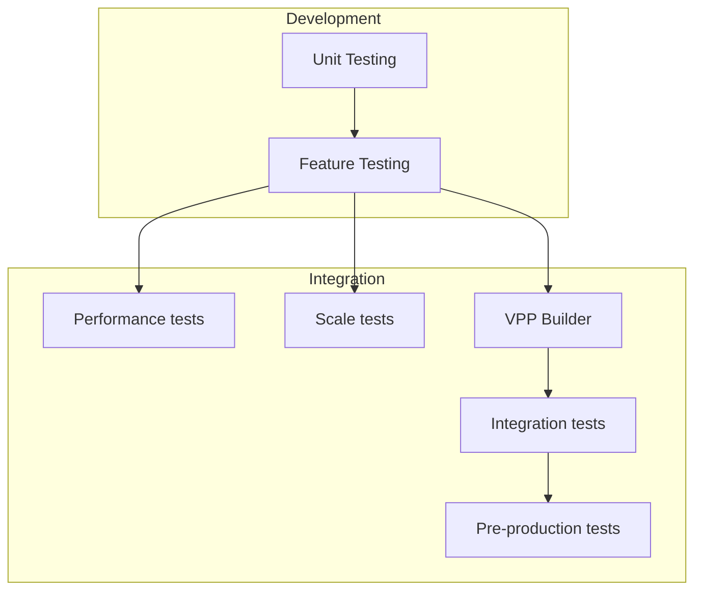
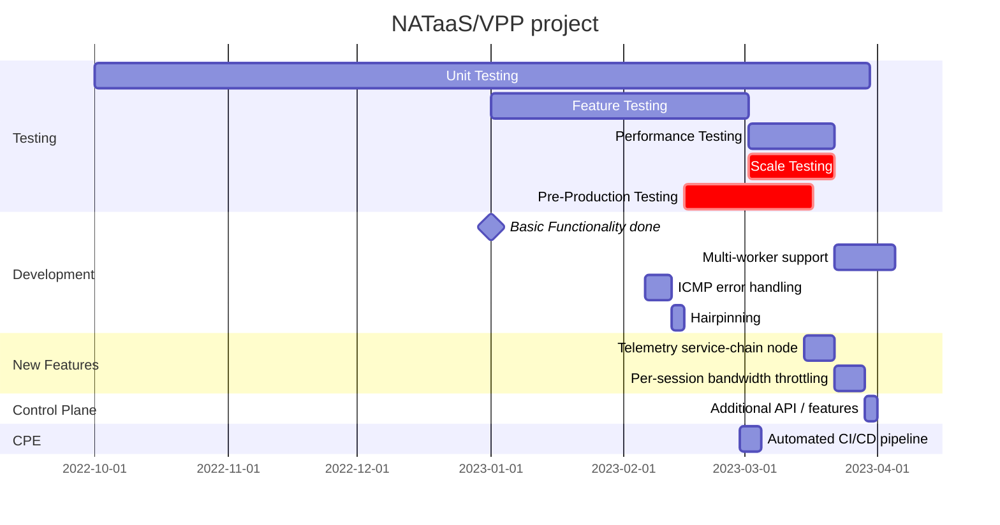

## Testing

Automated testing is a fundamental to make a CI/CD pipeline function and the underpinnings of the VPP consumption model.

The diagram below shows the various types of tests. It's expected that all of these run per-patch. 

There is currently no resources allocated to working on the tests in the Integration box.

## Project plan

## Task list
### Development

- [ ] ICMP error handing
- [ ] Hairpinning
- [ ] VRFs
- [ ] Multiworker
- [ ] Counters
	- [ ] Data-model (split gauge / counter)
	- [ ] Per-tunnel instance
	- [ ] Per-tenant instance
	- [ ] Per protocol (from telemetry service)
- [ ] Telemetry service
	- [ ] Most active speaker
- [ ] Add more information to tracing
- [ ] Tool to make session tracing more convenient
- [ ] CLI
	- [ ] Clear session table
	- [ ] Merge show vcdp session-table and session-detail
	- [ ] Add unset commands (or remove configuration through CLI)
- [ ] Optimize tunnels by using midchains / UDP encap DPO
- [ ] Optimize NAT rewrite with AVX512 copy with mask
- [ ] Control-plane
	- [ ] Add additional APIs
	- [ ] Use Pydantic for data model
	- [ ] Consider loading configuration files directly from VPP
### Testing
#### Development
- [ ] Isolated unit tests (including per node performance and scale tests)
- [ ] Sanitizers: clang-tidy, valigrind
- [ ] Complete feature tests (make test)
	- [ ] ICMP error
	- [ ] PMTU
	- [ ] Fragments
	- [ ] Merge CPE and NATaaS tests
	- [ ] Multiple addresses in pool
	- [ ] VRFs

#### Integration
- [ ] Performance tests (modelled on frouter)
- [ ] Scale tests
- [ ] Pre-production and integration tests

